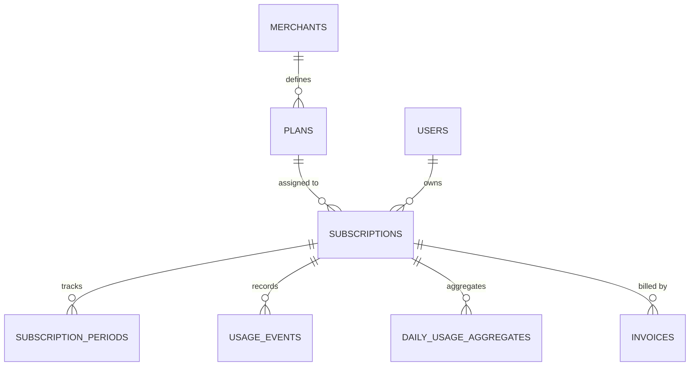

# Implementation Plan: Database Schema & Architecture Design (ERD & Class Structure)

Design and implement a normalized, high-performance relational schema and Eloquent model architecture for the **Subscription Billing & Usage-Metering System**. This plan covers table migrations, composite indexing for 50L+ scale, Eloquent models with typed relationships, and database seeders, adhering strictly to `.agents/rules/` (`commit_type.yml`, `laravel-docker.md`, `laravel-artisan-generation.md`).

---

## Configuration & Branching

- **Suggested Branch Name**: `feat/database-schema-and-models`
- **Docker Execution**: Wrap all commands in `docker exec mallow-laravel.test-1 ...`
- **Artisan Rule**: Always use `php artisan make:*` generators inside Docker.

---

## Relational Schema & Indexes (50L+ Optimization)



### Tables & Indexes

1. **`users`** (Default Laravel migration):
   - `id`, `name`, `email`, `password`, `timestamps`.
2. **`merchants`**:
   - `id`, `name`, `timestamps`.
3. **`plans`**:
   - `id`, `merchant_id` (FK), `name`, `base_price` (decimal 10,2), `billing_cycle` (enum: 'monthly', 'yearly'), `included_units` (unsignedInteger), `overage_rate` (decimal 10,4), `timestamps`.
   - Index: `merchant_id`.
4. **`subscriptions`**:
   - `id`, `user_id` (FK), `plan_id` (FK), `status` (enum: 'active', 'cancelled', 'past_due', 'paused'), `timestamps`.
   - Indexes: `(user_id, status)`, `plan_id`.
5. **`subscription_periods`** (Supports Req 8 mid-cycle plan switches):
   - `id`, `subscription_id` (FK), `plan_id` (FK), `starts_at` (datetime), `ends_at` (datetime), `status` (enum: 'active', 'closed'), `timestamps`.
   - Indexes: `(subscription_id, status)`, `(starts_at, ends_at)`.
6. **`usage_events`** (50L+ high-volume write table):
   - `id` (bigIncrements), `user_id` (FK), `subscription_id` (FK), `usage_date` (date), `units` (unsignedInteger), `idempotency_key` (string, unique), `timestamps`.
   - Indexes:
     - `unique(['idempotency_key'])`
     - `index(['subscription_id', 'usage_date'])`
     - `index(['user_id', 'usage_date'])`
7. **`daily_usage_aggregates`**:
   - `id`, `user_id` (FK), `subscription_id` (FK), `usage_date` (date), `total_usage` (unsignedBigInteger), `timestamps`.
   - Indexes:
     - `unique(['subscription_id', 'usage_date'])`
     - `index(['user_id', 'usage_date'])`
8. **`invoices`**:
   - `id`, `user_id` (FK), `subscription_id` (FK), `invoice_date` (date), `base_amount` (decimal 10,2), `overage_amount` (decimal 10,2), `total_amount` (decimal 10,2), `units_used` (unsignedBigInteger), `status` (enum: 'draft', 'pending', 'paid', 'void'), `timestamps`.
   - Indexes: `(subscription_id, invoice_date)`, `user_id`, `status`.

---

## Migration Execution Order

```
1. 0001_01_01_000000_create_users_table.php (Already in place)
2. create_merchants_table
3. create_plans_table
4. create_subscriptions_table
5. create_subscription_periods_table
6. create_usage_events_table
7. create_daily_usage_aggregates_table
8. create_invoices_table
```

---

## Eloquent Models & Relationships

All generated via `php artisan make:model <Name>`:
- `Merchant`: `hasMany(Plan)`, `hasManyThrough(Subscription, Plan)`
- `Plan`: `belongsTo(Merchant)`, `hasMany(Subscription)`
- `User`: `hasMany(Subscription)`, `hasMany(UsageEvent)`, `hasMany(Invoice)`
- `Subscription`: `belongsTo(User)`, `belongsTo(Plan)`, `hasMany(SubscriptionPeriod)`, `hasMany(UsageEvent)`, `hasMany(DailyUsageAggregate)`, `hasMany(Invoice)`
- `SubscriptionPeriod`: `belongsTo(Subscription)`, `belongsTo(Plan)`
- `UsageEvent`: `belongsTo(Subscription)`, `belongsTo(User)`
- `DailyUsageAggregate`: `belongsTo(Subscription)`, `belongsTo(User)`
- `Invoice`: `belongsTo(Subscription)`, `belongsTo(User)`

---

## Seeders Architecture

All generated via `php artisan make:seeder`:
1. `MerchantSeeder.php`: Seeds demo merchant (e.g. Acme Corp).
2. `PlanSeeder.php`: Seeds `Basic Plan` and `Premium Plan`.
3. `UserSeeder.php`: Seeds customer accounts.
4. `SubscriptionSeeder.php`: Links users to plans.
5. `DatabaseSeeder.php`: Orchestrates `MerchantSeeder`, `PlanSeeder`, `UserSeeder`, and `SubscriptionSeeder`.
6. `SubscriptionPeriodSeeder.php`: Standalone seeder for subscription periods, run separately via `php artisan db:seed --class=SubscriptionPeriodSeeder`.
