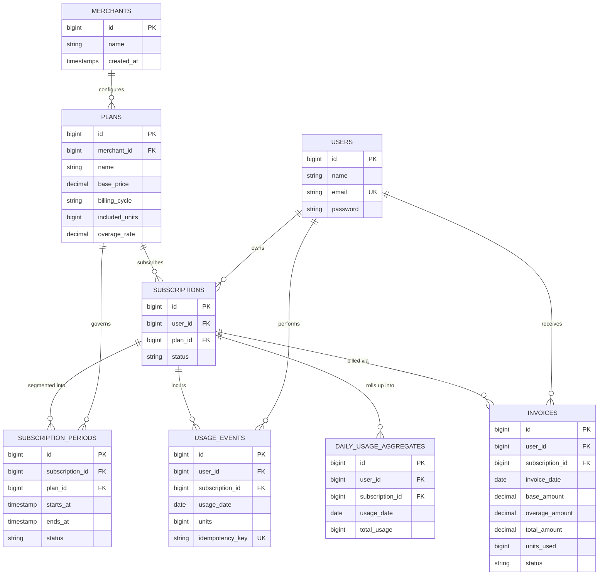

# Subscription Billing & Usage-Metering System

[](https://laravel.com)
[](https://php.net)
[-brightgreen)](file:///d:/mallow/tests)
[](LICENSE)

A high-performance, multi-tenant SaaS subscription billing and usage-metering backend engine built with Laravel. The system meters customer consumption (e.g. API requests) against subscription plan allowances, executes high-throughput idempotent ingestion, manages Redis-cached plan pricing, schedules memory-safe chunked rollups and cycle-end invoice generation, and scales gracefully under **50 Lakh+ (5,000,000+) usage event records**.

Developed for the **Mallow Technologies — Senior Laravel Developer Mini Task**.

---

## Table of Contents

- [Architecture & Domain Model](#architecture--domain-model)
  - [High-Level Architecture Diagram](#high-level-architecture-diagram)
  - [Entity-Relationship Diagram (ERD)](#entity-relationship-diagram-erd)
  - [Core Mathematical Formulas](#core-mathematical-formulas)
- [Tech Stack & Services](#tech-stack--services)
- [Setup & Execution Instructions (Docker / Sail)](#setup--execution-instructions-docker--sail)
  - [1. Clone Repository](#1-clone-repository)
  - [2. Environment Configuration](#2-environment-configuration)
  - [3. Start Docker Containers](#3-start-docker-containers)
  - [4. Run Migrations & Seeders](#4-run-migrations--seeders)
  - [Service URLs](#service-urls)
- [API & CLI Execution Details](#api--cli-execution-details)
  - [1. Usage Ingestion Endpoint (`POST /api/usage`)](#1-usage-ingestion-endpoint-post-apiusage)
  - [2. High-Throughput Usage Simulator (`usage:simulate-traffic`)](#2-high-throughput-usage-simulator-usagesimulate-traffic)
  - [3. Queued Daily Usage Aggregation (`usage:aggregate-daily`)](#3-queued-daily-usage-aggregation-usageaggregate-daily)
  - [4. Cycle-End Invoice Generation (`billing:generate-invoices`)](#4-cycle-end-invoice-generation-billinggenerate-invoices)
- [Automated Testing Suite](#automated-testing-suite)
- [50L+ Scaling, Assumptions & Edge Cases](#50l-scaling-assumptions--edge-cases)
- [What I'd Do Differently With More Time](#what-id-do-differently-with-more-time)

---

## Architecture & Domain Model

The application adopts a **Service-Oriented Architecture (SOA)** with strict separation of concerns:

- **Thin Controllers**: Purely handle HTTP request dispatching and JSON response formatting.
- **Form Requests**: Strict validation of incoming types, bounds, and user existence.
- **Data Transfer Objects (DTOs)**: Immutable data passing between transport and domain layers.
- **Dedicated Services**: Pure business logic encapsulated inside `UsageService`, `BillingService`, and `PlanCacheService`.
- **Chunked Background Jobs**: Scheduled worker jobs processing data in memory-safe windows.

### High-Level Architecture Diagram

```mermaid
flowchart TD
    Client(["HTTP Client / API Consumer"]) -->|POST /api/usage| RL["RateLimiter (120 req/min)"]
    RL --> UC["UsageController"]
    UC --> SUR["StoreUsageRequest (Validation)"]
    SUR --> DTO["RecordUsageDTO"]
    DTO --> US["UsageService"]
    
    subgraph Storage & Caching Layer
        US -->|Idempotency Check| UE[("usage_events (MySQL)")]
        US -->|Active Subscription Check| SUB[("subscriptions (MySQL)")]
        PCS["PlanCacheService"] <-->|Cached Pricing (TTL 10m)| REDIS[("Redis Cache")]
    end

    subgraph Scalable Scheduled Jobs
        CRON["Laravel Scheduler / Artisan CLI"] --> ADUJ["AggregateDailyUsageJob (chunk 5000)"]
        ADUJ -->|Grouped Rollup Upsert| DUA[("daily_usage_aggregates (MySQL)")]
        
        CRON --> GIJ["GenerateInvoiceJob (chunkById 500)"]
        GIJ --> BS["BillingService (Proration & Segment Math)"]
        BS --> INV[("invoices (MySQL)")]
    end
```

---

### Entity-Relationship Diagram (ERD)



---

### Core Mathematical Formulas

#### 1. Base Price Proration

For mid-cycle subscription starts or plan changes:

$$\text{Proration Fraction} = \frac{\text{Active Days in Cycle}}{\text{Total Days in Cycle}}$$

$$\text{Prorated Base Fee} = \text{Plan Base Price} \times \text{Proration Fraction}$$

#### 2. Usage Overage Charges

$$\text{Prorated Included Units} = \lfloor \text{Included Allowance} \times \text{Proration Fraction} \rceil$$

$$\text{Overage Units} = \max(0, \text{Total Recorded Units} - \text{Prorated Included Units})$$

$$\text{Overage Fee} = \text{Overage Units} \times \text{Plan Overage Rate}$$

$$\text{Total Invoice Amount} = \text{Prorated Base Fee} + \text{Overage Fee}$$

#### 3. Mid-Cycle Upgrades & Downgrades (Requirement 8)

When a customer upgrades or downgrades mid-cycle, the cycle is partitioned across multiple [SubscriptionPeriod](file:///d:/mallow/app/Models/SubscriptionPeriod.php) segments:
$$\text{Total Base} = \sum_{i=1}^{n} (\text{Plan}_i.\text{BasePrice} \times \frac{\text{SegmentDays}_i}{\text{CycleDays}})$$

$$\text{Total Overage} = \sum_{i=1}^{n} (\max(0, \text{SegmentUsage}_i - \lfloor \text{Plan}_i.\text{Allowance} \times \frac{\text{SegmentDays}_i}{\text{CycleDays}} \rceil) \times \text{Plan}_i.\text{OverageRate})$$

$$\text{Total Cycle Billing} = \text{Total Base} + \text{Total Overage}$$

---

## Tech Stack & Services

- **Application Framework**: Laravel 12.x / PHP 8.4
- **Relational Database**: MySQL 8.4 (with InnoDB, composite indexing, and transactional guarantees)
- **Caching Layer**: Redis Alpine (Plan and pricing cache with 10-minute TTL)
- **Email Testing**: Mailpit (local SMTP & Web UI)
- **Database Management**: phpMyAdmin Web GUI
- **Containerization**: Docker Compose / Laravel Sail

---

## Setup & Execution Instructions (Docker / Sail)

### 1. Clone Repository

```bash
git clone https://github.com/Vishnu-Selva-Kumar/mallow-mini-task.git
cd mallow-mini-task
```

### 2. Environment Configuration

Copy the example environment file:

```bash
cp .env.example .env
```

Ensure the ports match your local environment. Default configuration:

```env
APP_NAME=Laravel
APP_ENV=local
APP_PORT=8800

DB_CONNECTION=mysql
DB_HOST=mysql
DB_PORT=3306
DB_DATABASE=mallow
DB_USERNAME=sail
DB_PASSWORD=password

REDIS_CLIENT=phpredis
REDIS_HOST=redis
REDIS_PORT=6379

QUEUE_CONNECTION=database
CACHE_STORE=redis
```

### 3. Install Composer Dependencies

If PHP and Composer are not installed on your host system, install dependencies using Docker:

```bash
docker run --rm -v "${PWD}:/app" -w /app composer install --ignore-platform-reqs
```

*(Alternatively, if PHP & Composer are installed locally: `composer install`)*

### 4. Build & Start Docker Containers

Start all 5 containers (Laravel, MySQL, Redis, Mailpit, phpMyAdmin) in detached mode:

```bash
docker compose up -d
```

Verify running containers:

```bash
docker ps
```

### 5. Generate Application Key

```bash
docker exec mallow-laravel.test-1 php artisan key:generate
```

### 6. Run Migrations & Seeders

Run database migrations and seed all initial data (2 Merchants, 4 Plans, 12 Users, 12 Subscriptions, 13 Subscription Periods):

```bash
docker exec mallow-laravel.test-1 php artisan migrate:fresh --seed
```

### Service URLs

| Service | Host URL | Credentials |
| :--- | :--- | :--- |
| **Laravel App** | [http://localhost:8800](http://localhost:8800) | — |
| **phpMyAdmin** | [http://localhost:8000](http://localhost:8000) | Server: `mysql`, User: `sail`, Password: `password` |
| **Mailpit** | [http://localhost:8025](http://localhost:8025) | — |

---

## API & CLI Execution Details

### 1. Usage Ingestion Endpoint (`POST /api/usage`)

High-throughput, strictly idempotent usage recording endpoint.

- **URL**: `/api/usage`
- **Method**: `POST`
- **Headers**: `Content-Type: application/json`, `Accept: application/json`
- **Rate Limit**: 120 requests/minute per IP / user token

#### Request Payload

```json
{
  "user_id": 1,
  "usage_date": "2026-09-14",
  "units": 150,
  "idempotency_key": "evt-u1-20260914-99882"
}
```

#### Response (HTTP 201 Created - New Record)

```json
{
  "success": true,
  "message": "Usage event recorded successfully.",
  "data": {
    "id": 1,
    "user_id": 1,
    "subscription_id": 1,
    "usage_date": "2026-09-14",
    "units": 150,
    "idempotency_key": "evt-u1-20260914-99882",
    "created_at": "2026-09-14T13:45:00.000000Z"
  }
}
```

#### Idempotent Replay (HTTP 200 OK - Same Key)

Sending the identical payload again returns HTTP 200 without double-counting usage:

```json
{
  "success": true,
  "message": "Usage event already recorded (idempotent response).",
  "data": { ... }
}
```

---

### 2. High-Throughput Usage Simulator (`usage:simulate-traffic`)

Generates **120,000 real usage records** (10,000 per user across 12 active users) through the DTO and service layer **without using database seeders**:

```bash
docker exec mallow-laravel.test-1 php artisan usage:simulate-traffic --users=12 --records-per-user=10000
```

---

### 3. Queued Daily Usage Aggregation (`usage:aggregate-daily`)

Summarizes raw usage events into read-optimized daily rollup tables using `UsageEvent` Eloquent queries processed in memory-safe **5,000-row chunks**:

```bash
docker exec mallow-laravel.test-1 php artisan usage:aggregate-daily --date=2026-09-14
```

---

### 4. Cycle-End Invoice Generation (`billing:generate-invoices`)

Calculates base proration, segment allowances, and overage charges for all active subscriptions in **500-subscription chunks**:

```bash
docker exec mallow-laravel.test-1 php artisan billing:generate-invoices --start=2026-09-01 --end=2026-09-30
```

---

## Automated Testing Suite

The application includes unit and feature test suites covering edge cases, proration math, idempotency replays, and background jobs.

To run tests inside Docker:

```bash
docker exec mallow-laravel.test-1 php artisan test
```

---

## 50L+ Scaling, Assumptions & Edge Cases

### 1. 50L+ (5 Million+) Volume Strategy

- **Composite Indexing**:
  - `usage_events` has `UNIQUE (idempotency_key)` to guarantee atomic deduplication.
  - `INDEX (subscription_id, usage_date)` enables fast aggregation and billing window lookups across millions of rows.
  - `INDEX (user_id, usage_date)` provides sub-millisecond filtering for customer usage histories.
- **Read-Model Denormalization (`daily_usage_aggregates`)**:
  - Raw usage events are aggregated nightly into a rollup table indexed on `UNIQUE (subscription_id, usage_date)`.
  - Analytics and dashboard queries hit the aggregate table rather than performing `SUM()` queries over 50L+ raw rows.
- **Memory-Safe Chunking**:
  - `AggregateDailyUsageJob` processes raw events in chunks of **5,000** records using `UsageEvent::upsert()`.
  - `GenerateInvoiceJob` iterates active subscriptions in chunks of **500** (`chunkById(500)`).
- **MySQL Table Partitioning (Production Readiness)**:
  - For datasets exceeding 10M records, `usage_events` is structured for MySQL range partitioning by `YEAR(usage_date) * 100 + MONTH(usage_date)`, allowing instant drops of expired partitions without locking active write tables.

### 2. Idempotency & Race Conditions

- If two identical events arrive concurrently over the network:
  1. The first write succeeds.
  2. The concurrent write triggers a `UniqueConstraintViolationException` on `idempotency_key`.
  3. [UsageService](file:///d:/mallow/app/Services/UsageService.php) catches this exception and returns the existing event with `is_duplicate: true` (HTTP 200), preventing duplicate charges while keeping network retries idempotent.

### 3. Redis Caching & Invalidation

- [PlanCacheService](file:///d:/mallow/app/Services/PlanCacheService.php) caches plans (`plan:{id}`) and merchant plans (`merchant:{id}:plans`) with a 10-minute TTL (600s).
- Any plan price update immediately triggers `invalidate($plan)` to purge stale pricing from Redis.

### 4. Edge Cases Handled

- **Mid-Cycle Plan Changes (Req 8)**: Segmented into multiple [SubscriptionPeriod](file:///d:/mallow/app/Models/SubscriptionPeriod.php) records. Prorated base fees and tier allowances are calculated independently for each period segment.
- **Boundary Conditions**: Zero units or negative values are rejected with HTTP 422.
- **Inactive Users**: Ingestion attempts for users without active subscriptions are safely rejected with HTTP 422.

---

## What I'd Do Differently With More Time

1. **High-Throughput Streaming Buffer (Kafka / RabbitMQ / Redis Streams)**:
   - For ingestion rates exceeding 50,000 req/sec, decouple synchronous database writes by pushing events onto a Redis Stream or Kafka topic. A pool of parallel queue workers would batch-insert records into MySQL asynchronously.
2. **Columnar Database for Cold Analytics (ClickHouse / TimescaleDB)**:
   - Retain raw events in MySQL for the active billing cycle (30 days), and stream completed events into ClickHouse for analytical queries and multi-year trend reporting.
3. **Laravel Horizon & Distributed Batching**:
   - Refactor invoice generation to use `Bus::batch()` with Laravel Horizon to process tens of thousands of customer invoices across multi-node worker pools in parallel.
4. **Automated Payment Capture & Webhooks**:
   - Integrate Stripe / Razorpay webhooks to automatically charge saved customer cards upon invoice generation (`status: paid` / `status: failed`).
5. **Interactive Merchant Dashboard UI**:
   - Implement the complete wireframe using Laravel Livewire / Inertia.js with real-time WebSockets (Laravel Reverb) for live usage telemetry.

---

## License

This project is open-sourced software licensed under the [MIT license](LICENSE).
