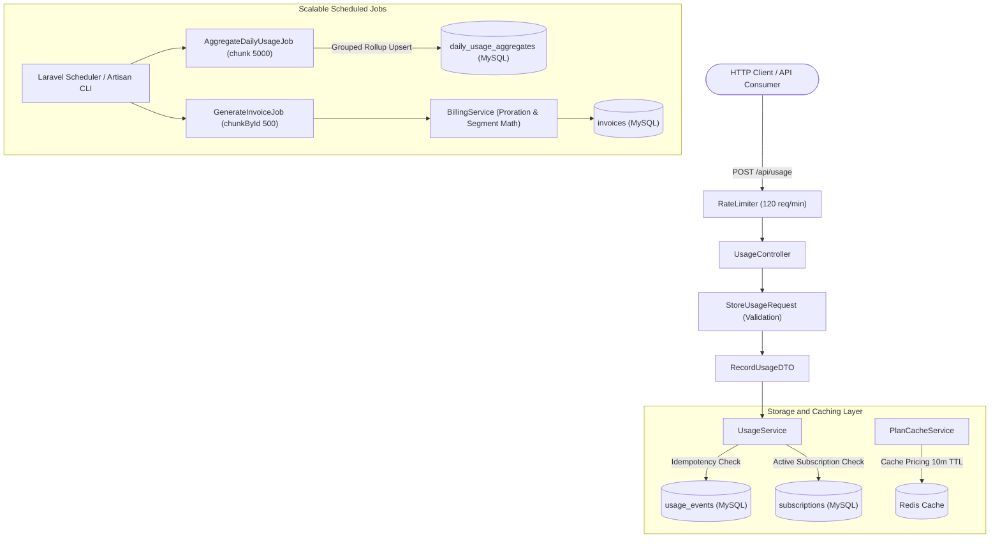
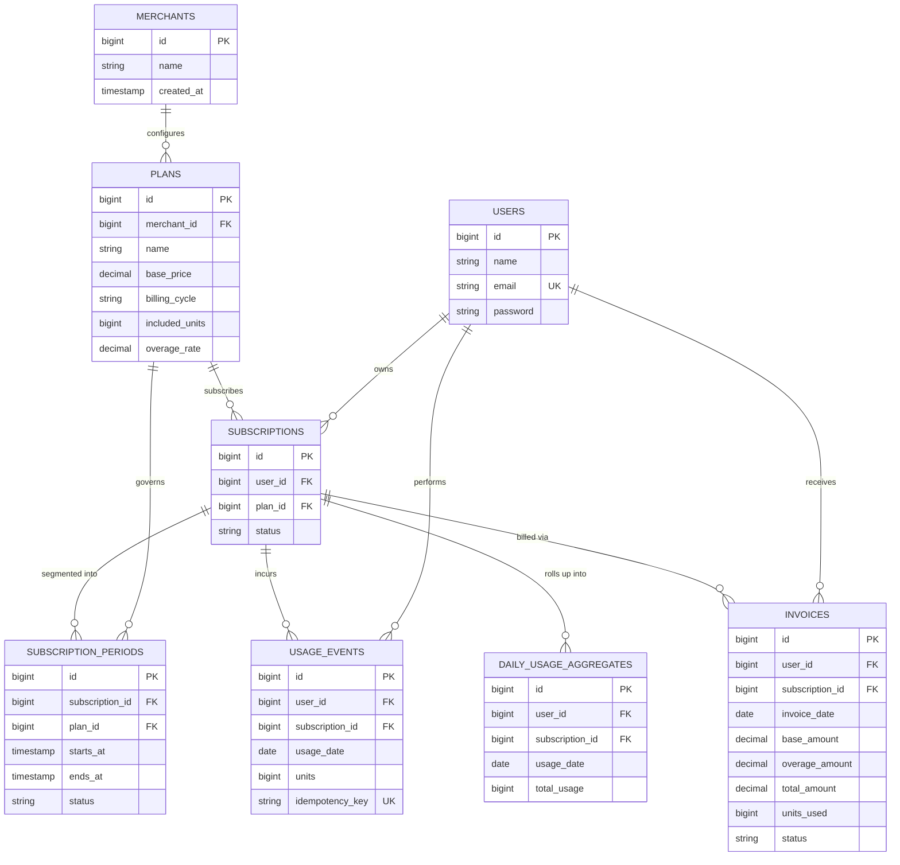

# System Architecture & Domain Model

This document details the architectural foundation, entity relationships, and mathematical models powering the **Subscription Billing & Usage-Metering System**.

---

## 1. High-Level Architecture

The application adopts a **Service-Oriented Architecture (SOA)** with strict separation of concerns:

- **Thin Controllers**: Purely dispatch incoming requests and format JSON/Blade responses.
- **Form Requests**: Enforce strict type checking, boundaries, and relationship constraints before reaching domain layers.
- **Data Transfer Objects (DTOs)**: Immutable, typed data structures bridging HTTP transport and business services.
- **Dedicated Services**: Pure domain logic encapsulated inside `UsageService`, `BillingService`, `SubscriptionService`, `MerchantDashboardService`, and `PlanCacheService`.
- **Chunked Background Jobs**: Scheduled worker jobs processing high-volume datasets in memory-safe windows.

---

## 2. Entity-Relationship Diagram (ERD)

---

## 3. Core Mathematical Formulas

### 1. Base Price Proration

For mid-cycle subscription starts or plan changes:

$$\text{Proration Fraction} = \frac{\text{Active Days in Cycle}}{\text{Total Days in Cycle}}$$

$$\text{Prorated Base Fee} = \text{Plan Base Price} \times \text{Proration Fraction}$$

### 2. Usage Overage Charges

$$\text{Prorated Included Units} = \lfloor \text{Included Allowance} \times \text{Proration Fraction} \rceil$$

$$\text{Overage Units} = \max(0, \text{Total Recorded Units} - \text{Prorated Included Units})$$

$$\text{Overage Fee} = \text{Overage Units} \times \text{Plan Overage Rate}$$

$$\text{Total Invoice Amount} = \text{Prorated Base Fee} + \text{Overage Fee}$$

### 3. Mid-Cycle Upgrades & Downgrades (Requirement 8)

When a customer upgrades or downgrades mid-cycle, the cycle is partitioned across multiple `SubscriptionPeriod` segments:

$$\text{Total Base} = \sum_{i=1}^{n} \left(\text{Plan}_i.\text{BasePrice} \times \frac{\text{SegmentDays}_i}{\text{CycleDays}}\right)$$

$$\text{Total Overage} = \sum_{i=1}^{n} \left(\max\left(0, \text{SegmentUsage}_i - \left\lfloor \text{Plan}_i.\text{Allowance} \times \frac{\text{SegmentDays}_i}{\text{CycleDays}} \right\rceil\right) \times \text{Plan}_i.\text{OverageRate}\right)$$

$$\text{Total Cycle Billing} = \text{Total Base} + \text{Total Overage}$$

---

[← Back to Main README](../README.md)
